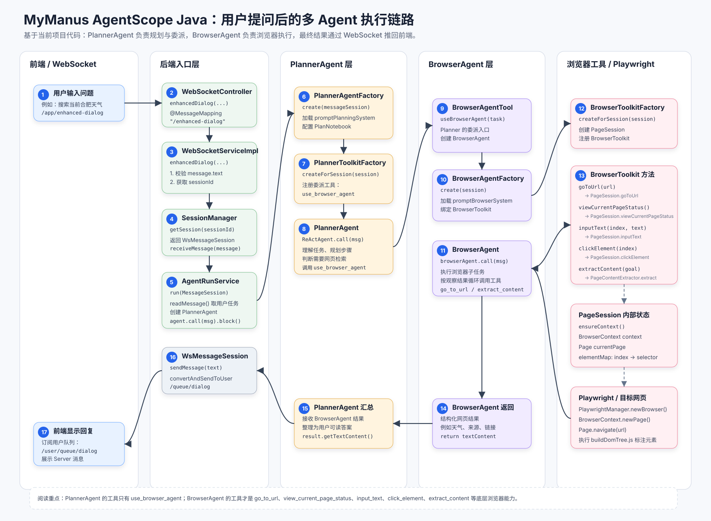

# 🌟 Manaus AgentScope Java — 全链路可观测智能体交互与管弦乐编排平台

[](https://spring.io/projects/spring-boot)
[](https://nuxt.com/)
[](https://github.com/modelscope/agentscope)
[](https://playwright.dev/)

**Manaus AgentScope Java** 是一个基于 **AgentScope Java SDK** 设计并深度构建的端到端 AI Agent 协作、管弦乐编排与交互管理中枢。系统采用现代化前后端分离架构，提供了低延迟流式响应、WebSocket/STOMP 双向通信、智能体执行轨迹（Trace）实时追踪、基于 **Microsoft Playwright** 的浏览器网页自动化探知，以及一套极具现代极简主义美学的沉浸式 Chat UI 交互界面。

---

## 🎨 核心系统架构与设计

平台将 AI 智能体推理过程中的“大模型思考（Thinking）”、“工具规划（Planning）”及“全链路执行步骤（Tracing）”完美融合，做到了从输入、推理、触发工具，到结果反馈的全生命周期闭环可视。

### 1. 全链路执行架构与数据流 (Prompt Full Chain Flow)

项目的执行流程完全依托于内部构建的高性能异步数据通道，将用户提问与 Agent 执行追踪进行了极佳的解耦：


### 2. 智能体问答执行与状态编排 (Agent Execution Flow)

当 Agent 被触发时，其思考与工具调用的具体逻辑如下图所示：



---

## ✨ 核心特性 (Key Features)

* **🤖 基于 AgentScope Core 的原生智能体编排**
  * 原生集成 `agentscope-core` Java 版。
  * 支持多智能体（Multi-Agent）的注册、状态协同、多轮对话管理。
* **🔍 全链路可观测追踪（Full-Chain Observability Trace）**
  * 在 Agent 运行时，其产生的每一步内部推理与 Tool 结果会通过 STOMP 协议实时流式地推送到前端。
  * 前端聊天气泡内嵌入“**查看执行步骤**”操作，支持右侧栏抽屉实时以 Timeline/代码高亮格式呈现每一步的系统级运行日志与决策链。
* **🌐 Microsoft Playwright 深度集成与网页自动化**
  * 赋能 Java 后端直接调起 Microsoft Playwright 操控真实浏览器，支持网页无头抓取与动态加载数据提取，扩展了 Agent 的感知边界。
* **💬 现代感极致轻量前端 (Rich Aesthetics Chat UI)**
  * **Nuxt 4 + Vite + Vue 3** 极速响应，完美适配响应式。
  * 支持高级的 Markdown 实时流式输出渲染（集成 `highlight.js` 和 `markdown-it`）。
  * 具备精美的微交互反馈，支持代码块**一键复制**、**折叠/展开**，以及 Markdown 中大图的高级尺寸控制、防溢出与**点击缩放/查看原图**交互。
* **🔄 双向实时低延迟推送 (WebSocket / STOMP)**
  * 通过持久性 WebSocket STOMP 信道维持客户端与后端的高频交互，消除轮询开销。

---

## 🛠️ 技术栈 (Technology Stack)

### 后端 (Backend - Java)
* **核心框架**：Spring Boot 3.4.3
* **通信协议**：Spring WebSocket / STOMP
* **智能体引擎**：AgentScope Java SDK (1.0.12)
* **自动化引擎**：Microsoft Playwright Java (1.51.0), Jsoup (1.17.2)
* **基础工具库**：Hutool (5.8.36), Lombok

### 前端 (Frontend - Nuxt)
* **核心框架**：Nuxt 4.4.5, Vue 3, Vue Router 5
* **通信库**：`@stomp/stompjs`
* **文本解析**：`markdown-it`, `highlight.js`
* **打包构建**：Vite 7.3.3, pnpm

---

## 📂 项目结构布局 (Project Directory Layout)

```text
manaus-agnetscope-java/
├── .idea/                 # IDE 配置文件
├── data/                  # 运行时持久化数据目录 (已忽略)
├── docs/                  # 流程图、Excalidraw 架构设计原件及图片预览
│   ├── agent-execution-architecture.svg
│   ├── agent-question-execution-flow.preview.png
│   └── prompt-full-chain-flow.preview.png
├── frontend/              # 前端 Nuxt 项目
│   ├── assets/css/        # 全局现代样式 (main.css)
│   ├── components/        # UI 组件 (ChatBubble, InputPanel 等)
│   ├── composables/       # 业务钩子 (useStomp, useMarkdown 等)
│   ├── pages/             # 视图页面
│   └── nuxt.config.ts     # Nuxt 配置文件
├── memory/                # Agent 对话会话历史与计划上下文缓存 (已忽略)
├── src/                   # 后端 Java 源码
│   └── main/java/butvan/cn
│       ├── AgentApplication.java # SpringBoot 启动入口
│       ├── agent/         # 智能体核心注册与运行服务
│       ├── conversation/  # 对话生命周期、历史持久化逻辑
│       └── websocket/     # STOMP / WebSocket 双向通信通道
├── pom.xml                # Maven 依赖配置文件
└── .gitignore             # 极简干净的 Git 过滤清单
```

---

## ⚡ 快速开始 (Quick Start)

### 1. 后端启动 (Spring Boot)

确保您的开发环境满足：**JDK 17** 及以上，并且配置好了 Maven。

1. **配置依赖安装**：
   ```bash
   mvn clean install
   ```
2. **修改配置文件**：
   在 `src/main/resources/application.yml` 中配置好您的 LLM 密钥（ApiKey）以及 AgentScope 运行时所需的相关代理参数。
3. **运行启动类**：
   打开您的 IDE（例如 IntelliJ IDEA），直接运行：
   [AgentApplication.java](file:///Users/butvan/IdeaProjects/manaus-agnetscope-java/src/main/java/butvan/cn/AgentApplication.java)

### 2. 前端启动 (Nuxt 4)

确保您的开发环境满足：**Node.js 18** 及以上，且推荐使用 **pnpm**。

1. **进入前端目录**：
   ```bash
   cd frontend
   ```
2. **安装依赖**：
   ```bash
   pnpm install
   ```
3. **运行开发服务器**：
   ```bash
   pnpm run dev
   ```
   启动成功后，即可在浏览器中访问 [http://localhost:3000](http://localhost:3000) 体验极致的 AI Agent 交互平台。

---

## 🎨 开发与提交规范 (Git Guidelines)

我们遵循最高级别的工程交付标准。在对本项目进行开发时，请务必保证：

1. **语义化提交**：Git 提交信息必须遵循 Conventional Commits 规范，格式为 `type(scope): 简体中文描述`。
2. **提交时机**：完成一个独立、自检通过、可回溯的工作单元后，立即执行 Git 提交，严防代码大量累积。
3. **安全防范**：已屏蔽本地运行时的 `data/`、`memory/` 会话缓存及 `.idea/` 相关个人配置，严禁强制覆盖他人提交。
